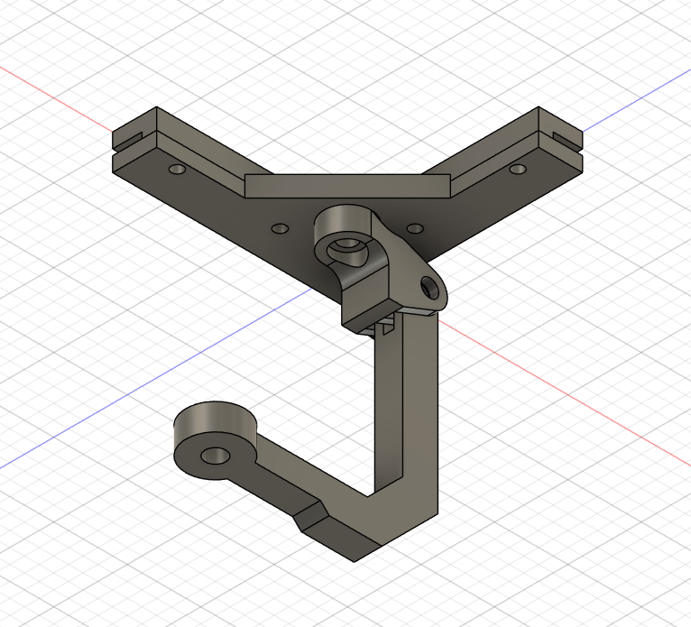
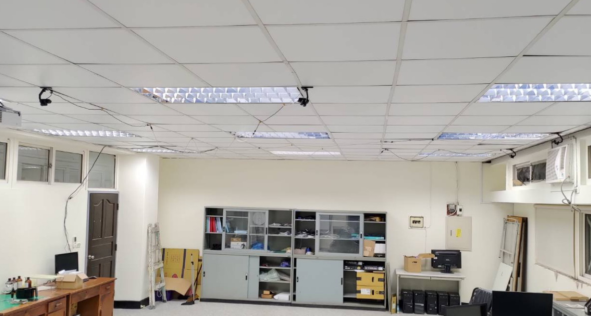
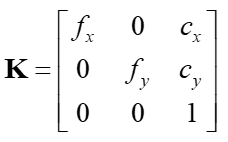
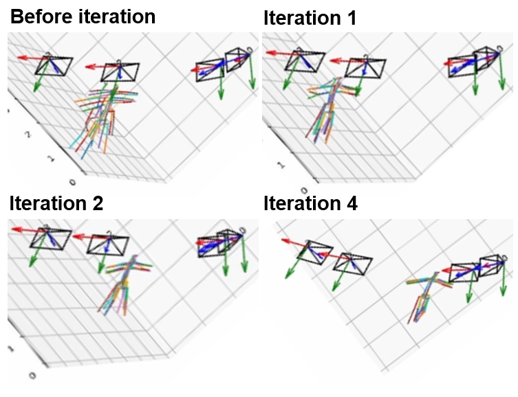
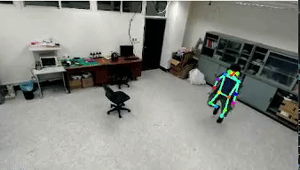

<br />
<div align="center">
  <h1 align="center">SnowMocap</h1>
  <h2 align="center">This project is still work in progress!!!</h2>
  <p align="center">
    A free Blender 3D multi-camera mocap solution.
    <br />
  </p>
</div>


Video demo: https://youtu.be/W_3FVEXP7Nk

## About This Project

(Sorry for the bad english, it's not my first language. (´c_`) )

I'm tring to build a simple but reliable 3D mocap solution for blender.

The goal of this project is to make the mocap setup as cheap as possible, so no expensive mocap ir cameras and no tracking suit, but also capable enough to use in all sorts of project(game asset, 3D animation, etc...)

I'll be using RGB wedcams + human keypoint detection to accomplish the 2D human feature extraction and multi-camera triangulation to get precise 3D keypoint result.

Finally, use the IK function within blender and the predefined rig the produce human skeleton animation.

Because the animation is already in the animation timeline of Blender, so it can be exported or modified easily.

At the current state, the result animation is still pretty janky and jittery, I'm planning to slowly fix these problems, and make this repo a more user friendly Blender plugin. 

So please stay tuned!!!

## Setup
The camera I'm using are 4 ASUS webcams(ASUS webcam c3)

https://www.asus.com/tw/accessories/streaming-kits/all-series/asus-webcam-c3/


Then I designed a 2DOF webcam mount to fix the webcam on th ceiling.

By doing so, I can get the widest view of the room.

Camera mount CAD:



3D printed camera mount + webcam:


Camera array:



Because the webcam's USB2.0 cable is not long enough to connect all 4 cameras to my computer.

I decided to use another computer as a recorder and transmit video stream via LAN(Socket UDP)

So the network structure look like this:

recorder computer: lan_streamer.py   ==frame data==>   main computer: snowmocap_live.py

## Installation
### Install Dependency
First, install all dependency.

```sh
pip install -r requirements.txt
```
### Install Simple-HRNet
Install simple-HRNet in the root folder.

https://github.com/stefanopini/simple-HRNet

Then, rename "simple-HRNet" folder to "HRNet".

### Download Synchronized Test Videos
Create a folder named "video" in root folder

```sh
mkdir video
```

Download all videos to the video folder

https://drive.google.com/drive/folders/1frEk-DhsxYdoJUIkspit7tTDXSINwjo5?usp=sharing

### Install Blender

https://www.blender.org/

Done!

## Camera Calibration
### Intrinsic Matrix



Simple use checkerboard calibrate to get the intrinsic matrix K.

https://docs.opencv.org/4.x/dc/dbb/tutorial_py_calibration.html


I wrote a GUI (PyQT5) to calibrate lan cameras (Cal_GUI.py), but it's a bit of a hassle to use, because you can only use it on lan cameras.

So I'll probably write a more versatile camera calibrate tool in the future.

### extrinsic Matrix


Once we get the intrinsic matrix we can start to find the extrinsic Matrix Rt.

Since we already have intrinsic matrix, we can use human keypoint detection and bundle adjustment algorithm to get all webcam's position and rotation.

Simply run bundle_adjustment.py and it will automatically output each webcam's position and rotation.

```sh
python bundle_adjustment.py
```




## Algorithm
The tracking method I choose is HRNet keypoint detection.




Because of its high resolution and multi-sacle feature extraction makes it very suitable for the project.

HRNet outputs the most satisfying keypoint detection result in my opinion.


