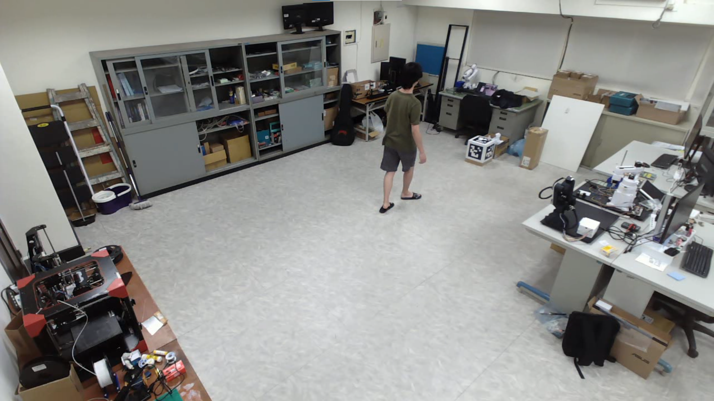
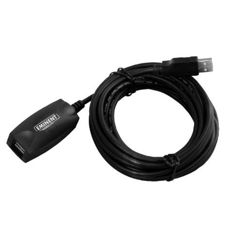

# SnowMocap - A free Blender mocap solution integrated with camera array 

[繁體中文文檔](docs/ch.md)

## Introduction

I'm building a simple but reliable 3D mocap solution for Blender.


The goal of this project is to make the mocap setup as cheap as possible, so no expensive mocap ir cameras or specialized tracking suit, but also capable enough to use in all sorts of project(game asset, 3D animation, etc...)

4 RGB wedcams + human keypoint detection were used to accomplish the 2D human feature extraction and multi-camera triangulation, and we can get the precise 3D Human keypoints.

Finally, use the predefined armature in Blender to translate the keypoint data and produce continuous 3D human skeletal animation.

## Get started

### Hardware
 - 4 webcams
 - 4 camera mounts (tripod)
 - 4 10m(or longer) USB signal booster cable
 - A computer with Nvidia GPU

### 1. Hardware Setup
**1. Room setup**

First, you need a space big enough for motion capturing. The room I used for this project is around 10m x 10m wide and 3m tall.



**2. Camera array setup**
 
Install all 4 webcams in 4 corners of the room using camera mounts or tripods. 

I used 4 custom 3D printed camera mounts to fix webcams on the ceiling for best viewing angle.


**3. USB cable setup**

The USB cable came with the webcams were around 1m, it not long enough to connect to the computer all across the room, so USB signal booster cables(>=10m) were required.



The USB cables needs to have **signal boost feature,** or the webcam's video stream signal will start to decay if the usb cable is longer than 6m.

Connect the webcams to the computer, I used some hooks to route the USB cables along the ceiling to my computer.


If you are using tripods, you can use duct tape to stick USB cables on the ground, to prevent tripping over by these cables.

**HARDWARE SETUP DONE!**

### 2. Software Setup
**1. Install miniconda**

**Virtual environment is recommended.**

https://www.anaconda.com/download/

You can still use local python to install the dependency and run this project, but it'll be a pain in the ass if you were trying to reinstall some packages.

Once miniconda is installed, open **Anaconda Prompt** and type:

```
conda create -n snowmocap python=3.8
```

To create a python 3.8 virtual environment for SnowMocap

**2. Install CUDA/CUDNN**

**CUDA/CUDNN installation is recommended.**

If you want to use cpu to run SnowMocap, you can skip this step.

But it take a lot longer to do human keypoint detection.

https://anaconda.org/nvidia/cuda-toolkit

```
conda install nvidia::cuda-toolkit
```

https://anaconda.org/anaconda/cudnn

```
conda install anaconda::cudnn
```

**3. Install rtmlib**

https://github.com/Tau-J/rtmlib

```
git clone https://github.com/Tau-J/rtmlib.git
cd rtmlib
pip install -r requirements.txt
pip install -e .
pip install onnxruntime-gpu
```

rtmlib's installation might need a little work around to get it working correctly.

I have test the project on two PCs, one with RTX4060 and other with RTX3060.

It turns out that **the onnxruntime/onnxruntime-gpu and cuda/cudnn version will be different for different GPUs.**

```python
#PC with RTX3060
cuda                  12.8.0
cudnn                 9.1.1.17
onnxruntime           1.16.0
onnxruntime-gpu       1.19.0

#PC with RTX4060
cuda                  12.6.3
cudnn                 9.1.1.17
onnxruntime           1.19.2
onnxruntime-gpu       1.19.2
```

You can use the following command to pip install a package in specific version.

```
pip install package_name==version
```

If you want to install onnxruntime-gpu in version 1.19.0, it'll looks like :

```
pip install onnxruntime-gpu==1.19.0
```

**4. Install SnowMocap**

```
git clone https://github.com/liaochikon/SnowMocap.git
cd SnowMocap
pip install -r requirements.txt
```

**5. Install Blender**

https://www.blender.org/download/

**SOFTWARE SETUP DONE!**

### 3. Pre-Recorded Demo

The folder named **videos** in the root directory is where you'll put your videos for motion capturing.

So the directory will looks like :

```
${SnowMocap}
├── blender
├── configs
├── docs
├── image
├── mocap_data_output
├── snowvision
├── videos
    ├── video0.avi
    ├── video1.avi
    ├── video2.avi
    ├── video3.avi
...
```

Download the videos I recorded and put them in the **videos** folder.

Videos : 
[( Google Drive )](https://drive.google.com/drive/folders/1tiRy1VV34z3RA42Lt3HkuZKdGh1zT4BU?usp=drive_link)

Simply run :

```
python main.py configs\snowmocap_default_config.json
```

The **snowmocap_default_config.json** in config folder saves the setting for running SnowMocap.

You can change the parameters in this config file to suit your needs.

``` json
{
    "camera_group_info_path" : "configs/camera_group_floor.json", //Camera parameters file path
    "rtmlib_model_alias" : "Wholebody", //Rtmlib model used for keypoint detection
    "rtmlib_model_backend" : "onnxruntime", //Rtmlib model's backend framework, it either "onnxruntime" or "openvino"
    "rtmlib_model_device" : "cuda", //Device that the model runs on, for GPU : "cuda", for CPU : "cpu"
    "video_names" : ["videos/04212024194216_0.avi",
                     "videos/04212024194216_1.avi",
                     "videos/04212024194216_2.avi",
                     "videos/04212024194216_3.avi"], //Pre-recorded videos for mocaping, it need to have at least 2 videos
    
    //2D human keypoints & human triangulation parameters
    "keypoint_score_threshold" : 3.0,
    "average_score_threshold" : 0.0,
    "distance_threshold" : 0.05,
    "condense_distance_tol" : 10,
    "condense_person_num_tol" : 0,
    "condense_score_tol" : 0.0,
    "center_point_index" : 0,
    "keypoint_num" : 133,
    //

    //3D human motion smooth parameters
    "smooth_f" : 2.5,
    "smooth_z" : 0.75,
    "smooth_r" : 0,
    "smooth_delta_time" : 0.03333333333,
    //


    "blender_armature_profile_path" : "configs/blender_armature_profile.json", //Blender's armature control bone description file path.
    "blender_smooth_profile_path" : "configs/blender_smooth_profile.json", //Blender's armature control bone smooth parameters file path.
    "mocap_data_output_path" : "mocap_data_output/blender_mocap_data.json", //Mocap data's save path, if the file already exists, the file will change it's name to "blender_mocap_data_0.json" or "blender_mocap_data_1.json" etc...
    "show_video" : true, //Show videos with skeleton visualization
    "show_plot" : false //Show 3D human pose in matplotlib
}
```

Then SnowMocap will start to mocaping pre-recorded videos.


After finishing motion capturing, the mocap data will be saved in **mocap_data_output** folder as a json file.

Open **animation_import_scene.blend** in **blender** folder.

Click the **Scripting** tab.


Click the **Run Script** button, and the mocap data will be transfer to the rig in the Blender scene.


The mocap data's animation keyframes.


The Blender's mocap data transfer setting is in **animation_import.json**, which can be found in **blender** folder.

``` json
{
    "blender_result_list_path" : "../mocap_data_output/blender_mocap_data.json", //Mocap data path
    "blender_armature_index_path" : "../configs/blender_armature_profile.json", //Blender's armature control bone description file path.
    "start_frame" : 20, //The start keyframe in timeline for mocap data transfer
    "frame_gap" : 2 //The keyframe gap in timeline for mocap data transfer, the animation frame in Blender is 60FPS and the videos are 30FPS, so 60 / 30 = 2
}
```

**DEMO DONE!**

### Camera Calibration Tools

Coming soon...

### 5. Motion Capture Workflow

Coming soon...

### 6. Blender Animation

Coming soon...

## Modification

Coming soon...

## Contact

Coming soon...