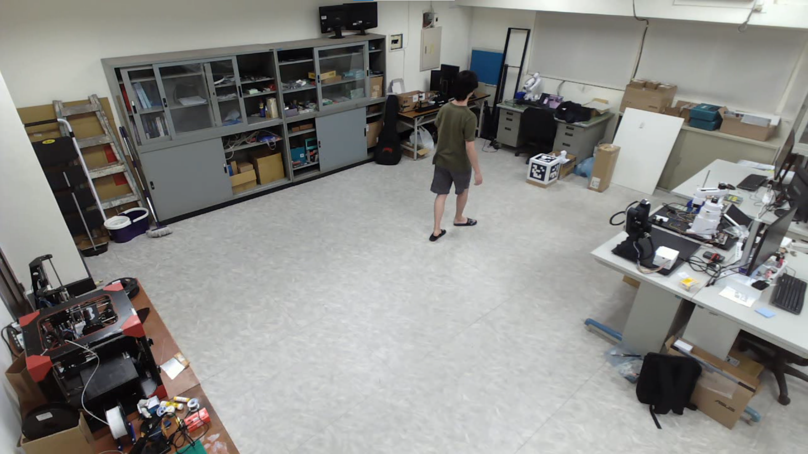
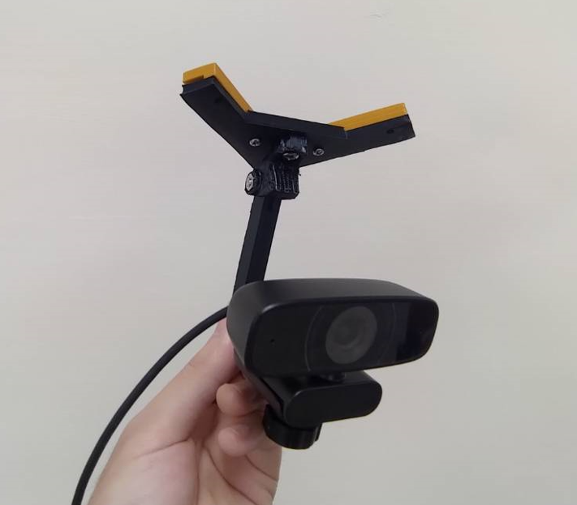
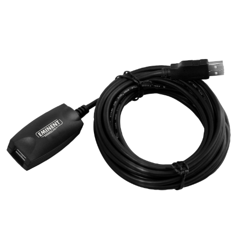

# SnowMocap - Blender 多相機AI動作捕捉

## 介紹

SnowMocap 是一個基於 Blender 的 3D 動作捕捉解決方案。


這個專案的目標是盡可能降低動作捕捉設置的成本，但同時也要足夠強大，能夠應用於各種如：遊戲製作、3D動畫等專案。

SnowMocap 使用到了 4 個 RGB 網路攝影機 + 人體關鍵點檢測來完成 2D 人體特徵提取和多攝影機三角測量，從而獲得精確的 3D 人體關鍵點，最後以 Blender 中預定義的骨架來轉換關鍵點數據，並產生連續的 3D 人體骨骼動畫。

## 開始使用

### 所需硬體
 - 4 個網路攝影機
 - 4 個相機腳架
 - 4 10m ( 或更長 ) 的 USB 訊號延長線
 - 搭載 Nvidia 顯示卡的電腦

### 1. 硬體架設
**1. 空間設置**

首先，你需要一個夠大的空間進行動作捕捉。我用的房間大概是 10m x 10m 寬，高 3m。



**2. 相機架設**
 
用相機腳架把 4 個網路攝影機安裝在房間的 4 個角落。

我這邊用了 4 個自製的 3D 列印相機支架，把網路攝影機固定在天花板的輕鋼架上，這樣做的好處是相機視野比較好。



**3. USB 接線**

網路攝影機本身的 USB 線大約 1 公尺長，不足以連接到房間另一端的電腦，因此需要用到 USB 訊號延長線（>=10 公尺）。



USB 線需要具有**訊號增強功能**，否則當 USB 線長度超過 6 公尺時，網路攝影機的視訊串流訊號會開始衰減 ( 會有很奇怪的雜訊 )。

將網路攝影機連接到電腦，我用了一些 3D 列印的掛鉤沿著天花板將 USB 線路走線到我的電腦。


如果這步你用的是三腳架，建議用膠帶把 USB 線黏在地板上，不然很容易踢到線跌倒。

**硬體架設完畢!**

### 2. 軟體架設
**1. 安裝 miniconda**

**建議使用虛擬環境**

https://www.anaconda.com/download/

其實也可以用本地 Python ，但如果有些 package 出錯要重新安裝就會很麻煩。

一旦 Miniconda 安裝完成，打開 **Anaconda Prompt** 並輸入：

```
conda create -n snowmocap python=3.8
```

為 SnowMocap 創建一個 Python 3.8 的虛擬環境。

**2. 安裝 CUDA/CUDNN**

**建議安裝 CUDA/CUDNN**

如果你只想使用 CPU 使用 SnowMocap，可以跳過這步。

但使用 CPU 進行人體關鍵點檢測會花費更長的時間。

https://anaconda.org/nvidia/cuda-toolkit

```
conda install nvidia::cuda-toolkit
```

https://anaconda.org/anaconda/cudnn

```
conda install anaconda::cudnn
```

**3. 安裝 rtmlib**

https://github.com/Tau-J/rtmlib

一樣在 **Anaconda Prompt** 輸入：

```
git clone https://github.com/Tau-J/rtmlib.git
cd rtmlib
pip install -r requirements.txt
pip install -e .
pip install onnxruntime-gpu
```

rtmlib 的安裝可能需要一些小調整才能正確運作。

我有在兩台電腦上測試過這個專案，一台配備 RTX4060，另一台配備 RTX3060。

結果發現，針對不同的 GPU，**onnxruntime/onnxruntime-gpu 和 cuda/cudnn 的版本會有所不同** ( 如下表 )。

```python
#PC with RTX3060
cuda                  12.8.0
cudnn                 9.1.1.17
onnxruntime           1.16.0
onnxruntime-gpu       1.19.0

#PC with RTX4060
cuda                  12.6.3
cudnn                 9.1.1.17
onnxruntime           1.19.2
onnxruntime-gpu       1.19.2
```

下面的命令可以用 pip 安裝特定版本的套件。

```
pip install package_name==version
```

如果你想安裝 1.19.0 版本的 onnxruntime-gpu，看起來會像這樣：

```
pip install onnxruntime-gpu==1.19.0
```

**4. 安裝 SnowMocap**

在 **Anaconda Prompt** 輸入：

```
git clone https://github.com/liaochikon/SnowMocap.git
cd SnowMocap
pip install -r requirements.txt
```

**5. 安裝 Blender**

去下面的連結安裝 Blender

https://www.blender.org/download/

**6. 新增資料夾**

在根目錄中新增兩個名為 videos 和 mocap_data_output 的資料夾。

目錄結構看起來會像這樣：

```
${SnowMocap}
├── blender
├── configs
├── docs
├── image
├── mocap_data_output
├── snowvision
├── videos
...
```

**軟體架設完畢!**

### 3. 預錄影像 Demo

到下面的連結把所有影片載下來，然後放進 **videos** 資料夾。

Videos : 
[( Google Drive )](https://drive.google.com/drive/folders/1tiRy1VV34z3RA42Lt3HkuZKdGh1zT4BU?usp=drive_link)

在 **Anaconda Prompt** 輸入：

```
python main.py configs\snowmocap_default_config.json
```

**config** 資料夾中的 **snowmocap_default_config.json** 有所有關於 SnowMocap 的使用設定。

你可以調整設定檔中的參數來滿足你的需求。

``` json
{
    "camera_group_info_path" : "configs/camera_group_floor.json", //相機參數檔路徑
    "rtmlib_model_alias" : "Wholebody", //用來檢測人體關鍵點的 rtmlib 模型
    "rtmlib_model_backend" : "onnxruntime", //rtmlib 模型的後端框架, 有 "onnxruntime" 和 "openvino"
    "rtmlib_model_device" : "cuda", //模型運行的裝置, GPU : "cuda", CPU : "cpu"
    "video_names" : ["videos/04212024194216_0.avi",
                     "videos/04212024194216_1.avi",
                     "videos/04212024194216_2.avi",
                     "videos/04212024194216_3.avi"], //用於動作捕捉的預錄影片集路徑, 一組影片集至少需要兩個影片
    
    //2D 人體關鍵點檢測和人體三角測量參數
    "keypoint_score_threshold" : 3.0,
    "average_score_threshold" : 0.0,
    "distance_threshold" : 0.05,
    "condense_distance_tol" : 10,
    "condense_person_num_tol" : 0,
    "condense_score_tol" : 0.0,
    "center_point_index" : 0,
    "keypoint_num" : 133,
    //

    //3D 人體動作平滑化參數
    "smooth_f" : 2.5,
    "smooth_z" : 0.75,
    "smooth_r" : 0,
    "smooth_delta_time" : 0.03333333333,
    //


    "blender_armature_profile_path" : "configs/blender_armature_profile.json", //Blender的控制骨架描述檔路徑
    "blender_smooth_profile_path" : "configs/blender_smooth_profile.json", //Blender的控制骨架平滑化參數描述檔路徑
    "mocap_data_output_path" : "mocap_data_output/blender_mocap_data.json", //動作捕捉數據的存檔路徑，如果文件已存在，則文件將更改名稱為 "blender_mocap_data_0.json" 或 "blender_mocap_data_1.json" 等...
    "show_video" : true, //在動作捕捉時顯示有 2D 關鍵點骨架的實時影像
    "show_plot" : false //在動作捕捉時顯示實時 3D 骨架
}
```

運行上面的命令後，SnowMocap就會開始進行動作捕捉。


完成動作捕捉後，動作捕捉數據將以 JSON 檔案的形式保存在 **mocap_data_output** 資料夾中。

打開在 **blender** 資料夾中的 **animation_import_scene.blend**。

點擊 **Scripting** 頁面。


點擊 **Run Script** 按鈕，動作捕捉數據便會被傳輸到 Blender 場景中的骨架。


動作捕捉數據的動畫關鍵幀。


Blender 的動作捕捉數據傳輸設定位於 **animation_import.json** 中，該檔案可以在 **blender** 資料夾中找到。

``` json
{
    "blender_result_list_path" : "../mocap_data_output/blender_mocap_data.json", //動作捕捉數據路徑
    "blender_armature_index_path" : "../configs/blender_armature_profile.json", //Blender的控制骨架描述檔路徑
    "start_frame" : 20, //動作捕捉數據傳輸的起始關鍵幀
    "frame_gap" : 2 //動作捕捉數據傳輸的關鍵幀間隔，在Blender中動畫的幀數設定為60FPS，預錄影片為30FPS，60 / 30 = 2
}
```

最後你應該可以在 Blender 中看到如連結中的動畫：

[Demo result](https://www.youtube.com/watch?v=31JdTrtbHrc)

**預錄影像 Demo 結束!**

### 4. 相機陣列校正工具箱

Coming soon...

### 5. 動作捕捉工作流程

Coming soon...

### 6. Blender 動畫

Coming soon...

## 修改 / 二次開發

Coming soon...

## 聯繫方式

Coming soon...